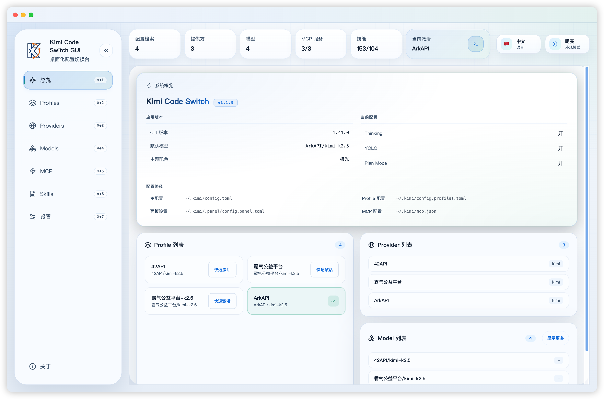
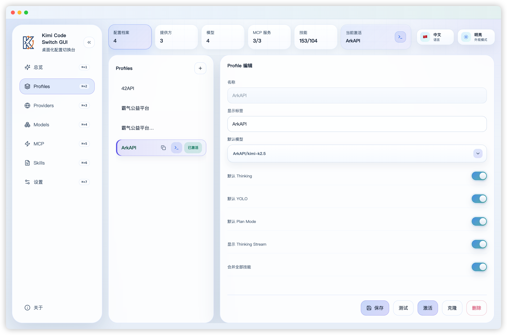
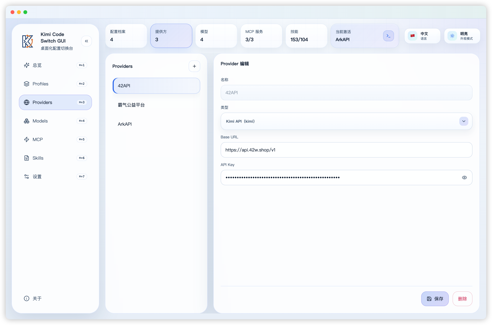
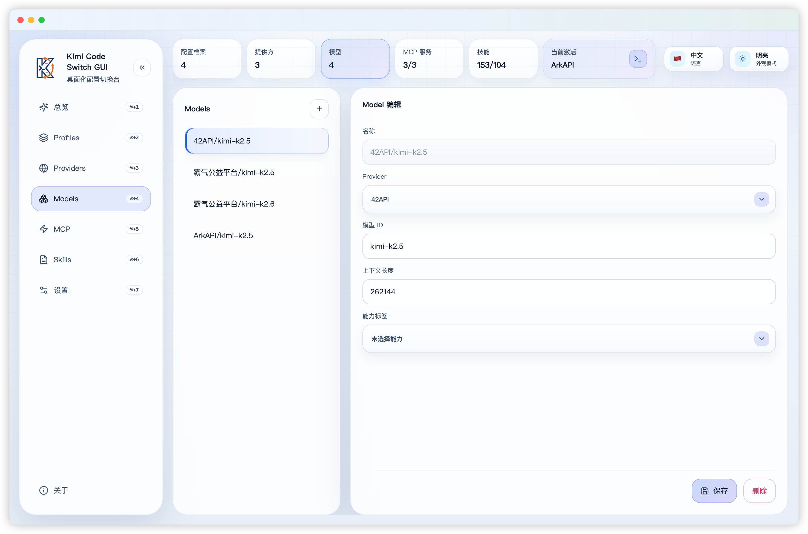
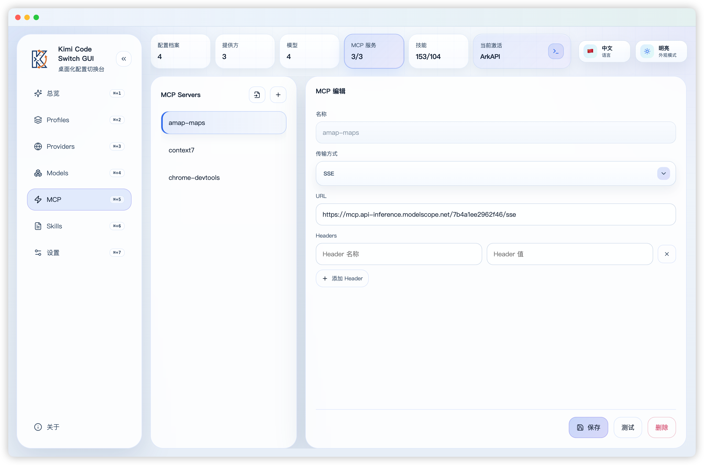
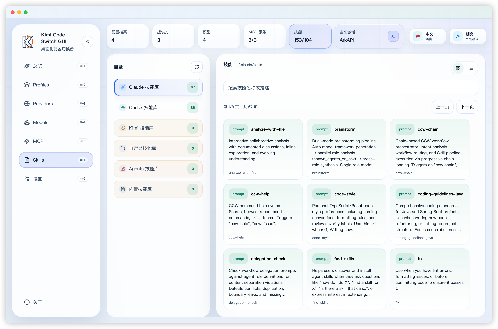
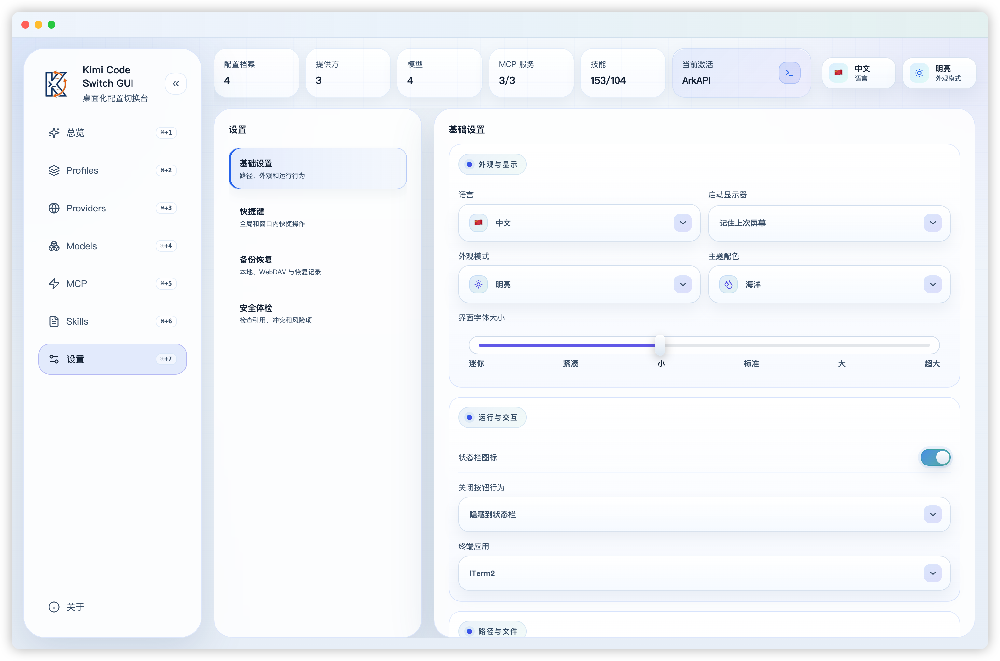

# Kimi Code Switch GUI

面向 `kimi-code-cli` 的桌面配置工作台。它把 Provider、Model、Profile、MCP、Skills、快捷键、备份和面板偏好集中到一个可视化界面里，减少手写 TOML / JSON 配置的风险。



## 为什么需要它

`kimi-code-cli` 的能力很强，但长期维护多套 Provider、模型和 Profile 时，配置文件会逐渐变复杂。这个工具的目标是把“改配置文件”变成明确、可预览、可回滚的桌面操作。

- 不再手动修改多个配置文件，降低格式错误和引用错误。
- 一处维护 Provider、Model、Profile、MCP Server 和 Skills。
- 写入前可预览、看 Diff、做配置体检，避免覆盖外部修改。
- 支持本地 / WebDAV 备份，出错时可以恢复。
- 支持状态栏、快捷键、主题、语言、更新检查和在终端打开 Kimi。

## 核心页面

### Profiles

管理不同工作场景下的默认模型、Thinking、YOLO、Plan Mode、Thinking Stream 和 Skills 合并策略。激活 Profile 后会同步更新 `kimi-code-cli` 主配置。



常用能力：

- 新增、克隆、删除、重命名 Profile。
- 一键激活 Profile。
- 测试当前 Profile 连通性。
- 在顶部“当前激活”区域直接用已激活 Profile 打开 Kimi。
- 在 Profiles 列表行悬浮后，可用被点击的 Profile 打开 Kimi，不会改变当前激活状态。

### Providers

集中维护所有模型供应方，例如 Kimi 官方 API、OpenAI 兼容网关、内部代理或其他兼容服务。



常用能力：

- 配置 Provider 类型、Base URL 和 API Key。
- 支持新增、克隆、删除和重命名。
- 删除前检查是否仍被 Model 引用。

### Models

将模型定义从 Provider 中拆出来独立维护，便于多个 Profile 复用同一模型。



常用能力：

- 配置 Provider、模型 ID、上下文长度和能力标签。
- 自动维护模型命名规则。
- 删除前检查是否仍被 Profile 或当前默认模型引用。

### MCP

可视化维护 `~/.kimi/mcp.json`，支持远程 MCP 和本地命令式 MCP。



常用能力：

- 支持 `streamable-http`、`sse`、`stdio`。
- 支持导入 MCP JSON。
- 支持测试连接、触发授权、重置授权。
- 支持 headers、command、args、env 等配置。

### Skills

扫描本机 Skills 来源，查看启用状态、覆盖关系和具体内容。



常用能力：

- 支持技能名称、描述检索。
- 支持网格 / 列表视图。
- 列表模式会根据可视区域自动分页。
- 可查看 Skill 内容、路径来源和覆盖关系。

### 设置

设置页收纳界面偏好、快捷键、备份、配置体检等全局能力。



常用能力：

- 语言、外观模式、主题配色、字体大小。
- 状态栏图标、关闭按钮行为、启动显示器策略。
- 终端应用选择：系统终端或 iTerm2。
- 全局快捷键和窗口内快捷键录制、启停、冲突提示。
- 本地 / WebDAV 备份，支持手动、定时、修改后备份。
- 配置体检，发现缺失引用、风险配置和路径问题。

## 配置文件

应用会维护下面几类文件：

```text
~/.kimi-code/config.toml
~/.kimi-code/mcp.json
~/.kimi-code/skills/
~/.kimi-code/.panel/app.db
```

说明：

- `config.toml`：Kimi Code 标准主配置，保存当前生效的默认模型、Provider、Model 和其他 CLI 配置。
- `mcp.json`：Kimi Code 标准 MCP Server 定义。
- `skills/`：Kimi Code 标准 Skills 目录。
- `.panel/app.db`：GUI 自身 SQLite 数据库，保存 Profile、当前激活 Profile、语言、主题、快捷键、备份策略和终端应用等面板私有配置。

`config.profiles.toml` 不是 Kimi Code 标准配置文件。旧版本生成过该文件时，GUI 会在启动时读取其中的 Profile 数据并迁移到 SQLite，后续不会继续写入该文件。

## 终端启动

应用支持从界面直接打开 Kimi：

- 顶部“当前激活”卡片里的终端按钮：使用当前已激活的 Profile。
- Profiles 列表行里的终端按钮：使用鼠标悬浮行对应的 Profile，不改变当前激活 Profile。
- 终端类型可在设置页选择 `系统终端` 或 `iTerm2`。

启动时会生成临时配置文件，并执行：

```bash
kimi --config-file <临时配置文件>
```

临时配置位于：

```text
~/.kimi/.panel/tmp/terminal/
```

## 备份与恢复

支持两类备份目标：

- 本地目录。
- WebDAV 远端目录。

支持三种备份策略：

- 手动备份。
- 定时自动备份。
- 修改后自动备份。

备份文件包含主配置、面板设置（含 Profiles、当前激活 Profile、快捷键等 GUI 私有配置）和 MCP 配置。恢复前会创建回滚点，避免误恢复后无法回退。

## 配置历史

自动版本控制系统，每次保存配置时自动创建快照，支持查看历史版本和一键回滚。

**核心特性：**

- **自动快照** — 每次保存配置时自动捕获 Kimi 标准配置（config.toml、mcp.json）和 GUI SQLite 面板设置快照
- **智能去重** — SHA256 内容去重，相同内容不重复存储
- **gzip 压缩** — 快照文件 gzip 压缩存储，5KB 配置压缩后约 500B
- **版本查询** — 按文件类型过滤、时间倒序查询历史快照
- **一键回滚** — 回滚前自动创建"回滚点"快照，支持撤销回滚操作
- **自动清理** — 每次保存后自动清理 30 天前的旧快照，释放磁盘空间

**存储位置：**

- 元数据：`~/.kimi/.panel/usage/index.db`（SQLite `config_history` 表）
- 快照文件：`~/.kimi/.panel/history/{timestamp}-{file_id}.toml.gz`

**API 调用：**

```typescript
import {
  captureSnapshot,
  listSnapshots,
  getSnapshotContent,
  restoreSnapshot,
  cleanupOldSnapshots,
} from "@renderer/tauri/configHistory";

// 捕获快照
const snapshotId = await captureSnapshot("config", "~/.kimi/config.toml", "手动备份");

// 查询历史（最近 50 条）
const snapshots = await listSnapshots("config", 50);

// 获取快照内容
const content = await getSnapshotContent(snapshotId);

// 回滚到指定快照
const success = await restoreSnapshot(snapshotId);

// 清理 30 天前的快照
const deleted = await cleanupOldSnapshots();
```

## 安装与运行

### 环境要求

- Node.js 22+
- npm 10+
- macOS 或 Windows

### 本地开发

```bash
npm ci
npm run dev          # Tauri 开发模式（Rust 后端 + Vite 渲染层热更新）
npm run dev:web      # 仅渲染层（不带 Rust），纯 UI 调试用
```

### 测试

```bash
npm test
```

### 构建

```bash
npm run build
```

### 打包

```bash
npm run build        # Tauri 发布构建（当前平台）
```

按平台打包安装器：

```bash
npm run dist:mac     # macOS dmg
npm run dist:win     # Windows nsis
```

构建产物输出到 `src-tauri/target/<target>/release/bundle/`（dmg / nsis）。

## macOS 首次打开

本应用是个人维护的免费工具，秉持隐私优先、零遥测的原则，且未购买 Apple 开发者证书做签名与公证。因此从 GitHub Release 下载的 DMG 属于**未签名 / 未公证**应用，首次打开时 macOS 可能提示「已损坏，无法打开」或「无法验证开发者」。这并非应用真的损坏，而是 Gatekeeper 对未公证应用附加了隔离（quarantine）属性。

去隔离后即可正常打开，二选一：

- 安装到 `/Applications` 后，执行去隔离命令：

  ```bash
  sudo xattr -rd com.apple.quarantine "/Applications/Kimi Code Switch GUI.app"
  ```

- 或使用 Homebrew cask 安装时直接带上 `--no-quarantine`：

  ```bash
  brew install --cask --no-quarantine kimi-code-switch-gui
  ```

> English: This is a free, privacy-first personal tool distributed without an Apple Developer certificate (no code signing / notarization). macOS may show "App is damaged" or "cannot verify developer" on first launch — the app is fine, it just carries Gatekeeper's quarantine attribute. Remove it with `sudo xattr -rd com.apple.quarantine "/Applications/Kimi Code Switch GUI.app"`, or install via `brew install --cask --no-quarantine kimi-code-switch-gui`.

## 技术栈

- Tauri v2（Rust + 系统 WebView）
- React 18
- TypeScript
- Vite
- Vitest
- SQLite（Rust `rusqlite`，用量数据）/ `@iarna/toml`（配置）

> 采用「薄 Rust 壳 + 前端业务逻辑」架构：约 5300 行 `src/shared/` 业务逻辑跑在渲染层，Rust 后端只暴露文件 I/O、命令执行、HTTP、SQLite、系统托盘等系统能力。

## 目录结构

```text
.
├── src-tauri/src           # Rust 后端命令：fs_access / system / usage / tray
├── src/renderer/src        # React UI、样式、i18n、页面交互
├── src/renderer/src/tauri  # 适配层：window.kimiSwitch → invoke() / listen()
├── src/shared              # 纯逻辑：配置模型、序列化、状态转换、校验和单元测试
├── docs/images             # README 截图资源
└── .github/workflows       # GitHub Release 工作流
```

## 发布流程

仓库内置 [`.github/workflows/release.yml`](.github/workflows/release.yml)。

推送形如 `v2.0.0` 的 tag 后，工作流会运行测试（npm + cargo）、从 `CHANGELOGS/` 提取中英双语 release note 创建 GitHub Release、构建 macOS（dmg, arm64 + x64）/ Windows（nsis）安装包并上传，最后更新 `homebrew-kimi-code-switch` tap。

## 当前版本

- 应用版本：`2.1.2`
- 变更记录：[CHANGELOG.md](CHANGELOG.md)（按语言分文件维护，详见 [`CHANGELOGS/`](CHANGELOGS/)）

## 参与开发

贡献代码前请阅读 [CONTRIBUTING.md](CONTRIBUTING.md)。

## 许可证

MIT
